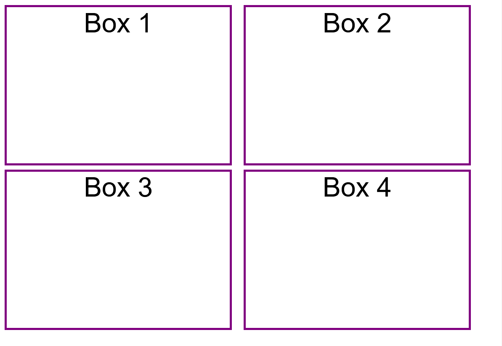

After HTML, CSS is the most common programming language on the internet, and can be the most exciting when you delve into the more advanced side of things.

Typically, CSS is used to change the look and feel of a website, colours, fonts, sizes, layout, how and where things appear on the page, but as CSS gets bigger and better, you can even use it to animate elements on your webpage!

Let's write our first line of CSS!

Fork the [template on CodePen.](https://codepen.io/shecodesaus/pen/KKyrEvB)

You should see four boxes (divs) like the following:



We'll start by changing the colour of the page.

Add the following CSS:

```css
/* Your CSS here */
body {
    background-color: #8246af;
}
```

{}

The page should turn into She Code's shade of purple!

{}

Nice work!
Your first line of CSS!

{}

Feel free to take a peek at the CSS we wrote for you.
This CSS is what arranges the divs in a grid and gives them borders.
In a few steps, you'll be able to create this too!

{}

